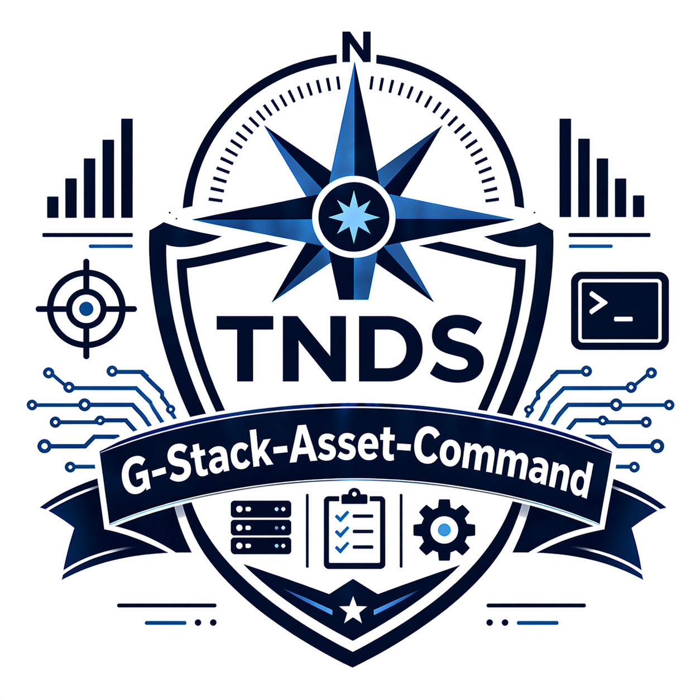

<div align="center">

# G-Stack Asset Command
### Google Sheets Fleet and Compliance Command System

[](https://nodejs.org)
[](LICENSE)
[](https://truenorthstrategyops.com)



</div>

## What this is
G-Stack Asset Command is an Apps Script module for fleet, asset, and driver compliance operations in Google Sheets. It provides a structured command surface for setup, dashboarding, and recurring operating checks.

## What it does
- Tracks assets, driver records, maintenance schedules, and fuel activity.
- Runs compliance checks for license/CDL/medical expirations and status drift.
- Serves dashboard views for assets, maintenance, compliance, and fuel analytics.
- Supports sidebar-driven entry and CSV template workflows for bulk loading.

## How it works
```text
Google Sheet
  -> Apps Script menu commands
    -> Data entry + validations
    -> Sheet updates (assets/drivers/maintenance/fuel)
    -> Dashboard rendering + alert checks
```

## Quick start
```bash
# from repo root
node setup.js
```

1. Follow prompts for company name, short name, icon, email, and phone.
2. Open the generated Apps Script project.
3. Run template setup from the custom menu in the target Sheet.

## Project structure
```text
.
|-- Code.gs
|-- FunctionRunner.gs
|-- TestRunner.gs
|-- Tests.gs
|-- Dashboard.html
|-- Sidebar.html
|-- Help.html
|-- appsscript.json
|-- setup.js
|-- USER-MANUAL.md
|-- G-Stack-Asset-Command.png
```

## License
MIT. See [LICENSE](LICENSE).

## Built by
Jacob Johnston | True North Data Strategies LLC | SDVOSB
